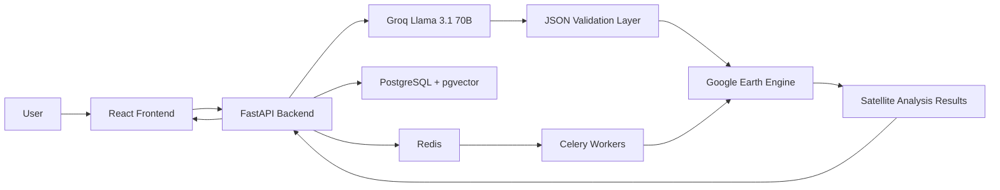

# Satellite Data Analysis Chatbot

An AI-powered geospatial intelligence platform that enables users to perform satellite data analysis using natural language.

Instead of writing complex Google Earth Engine (GEE) scripts, users can simply describe what they want to analyze. The system interprets the request, selects the appropriate dataset and workflow, executes the analysis through Google Earth Engine, and returns visual results with supporting explanations.


---

# Table of Contents

1. Overview
2. Features
3. Supported Analysis Operations
4. Supported Datasets
5. System Architecture
6. Request Processing Flow
7. Folder Structure
8. Technology Stack
9. How to Run Locally
10. Environment Variables
11. Architecture & Design Decisions
12. Challenges & Trade-offs
13. Security Considerations
14. Performance & Scalability
15. Future Improvements

---

# Overview

Satellite imagery contains valuable information about vegetation health, floods, urban expansion, deforestation, climate patterns, and environmental change.

However, extracting these insights traditionally requires expertise in:

* Remote Sensing
* GIS Software
* Google Earth Engine
* Satellite Data Processing

This project bridges that gap by providing a conversational interface for Earth Observation analysis.

Users can interact with satellite datasets using natural language while the platform handles:

* Dataset selection
* Workflow generation
* Google Earth Engine execution
* Result visualization
* Interpretation generation

---

# Features

### AI-Powered Natural Language Interface

Convert plain English requests into satellite analysis workflows.

### Google Earth Engine Integration

Uses Google Earth Engine for large-scale geospatial processing.

### Interactive Map Visualization

View analysis outputs directly on an interactive map.

### Automated Interpretation

Generates human-readable explanations for analysis results.

### Analysis History

Store and revisit previous analyses.

### Semantic Query Cache

Reduces repeated processing for similar requests.

### Background Task Processing

Supports long-running geospatial operations through Celery workers.

### Authentication & Session Management

Secure user sessions using JWT authentication.

---

# Supported Analysis Operations

| Analysis                    | Purpose                        |
| --------------------------- | ------------------------------ |
| NDVI                        | Vegetation Health Monitoring   |
| NDWI                        | Water Body Detection           |
| EVI                         | Enhanced Vegetation Monitoring |
| Crop Health Assessment      | Agricultural Monitoring        |
| Flood Mapping               | Flood Extent Detection         |
| Land Cover Classification   | Land Use Analysis              |
| Land Cover Change Detection | Temporal Change Analysis       |
| Deforestation Detection     | Forest Monitoring              |
| Urban Heat Island (UHI)     | Urban Temperature Analysis     |
| NDBI                        | Built-up Area Detection        |
| Burn Area Analysis          | Fire Impact Assessment         |
| SAR Analysis                | Radar-Based Monitoring         |
| Time-Series Analysis        | Multi-Date Comparisons         |

---

# Supported Datasets

The platform leverages datasets available through Google Earth Engine, including:

### Optical Satellites

* Sentinel-2
* Landsat 8
* Landsat 9
* MODIS

### Radar Satellites

* Sentinel-1 SAR

### Land Cover Products

* Dynamic World
* ESA WorldCover

### Climate & Weather

* CHIRPS Rainfall
* ERA5 Climate Data

### Terrain Data

* SRTM DEM

Additional datasets can be integrated through Google Earth Engine.

---

# System Architecture

```text
User Query
      │
      ▼
Frontend (React + Leaflet)
      │
      ▼
FastAPI Backend
      │
      ▼
LLM Processing Layer
      │
      ▼
JSON Validation Layer
      │
      ▼
Google Earth Engine
      │
      ▼
Analysis Results
      │
      ▼
Map Visualization + Interpretation
```

---

## High-Level Architecture



---

# Request Processing Flow

```text
Natural Language Query
          │
          ▼
Intent Understanding
          │
          ▼
Structured JSON Generation
          │
          ▼
Validation Layer
          │
          ▼
GEE Operation Selection
          │
          ▼
Satellite Processing
          │
          ▼
Result Generation
          │
          ▼
Visualization & Interpretation
```

---

# Folder Structure

```text
Satellite-Data-Analysis-Chatbot/

├── backend/
│   ├── app/
│   │   ├── api/
│   │   ├── core/
│   │   ├── services/
│   │   ├── models/
│   │   ├── schemas/
│   │   ├── db/
│   │   └── main.py
│   │
│   ├── workers/
│   ├── requirements.txt
│   └── Dockerfile
│
├── frontend/
│   ├── src/
│   │   ├── components/
│   │   ├── pages/
│   │   ├── layouts/
│   │   ├── context/
│   │   └── services/
│   │
│   ├── package.json
│   └── vite.config.js
│
└── README.md
```

---

# Technology Stack

## Frontend

* React
* Vite
* Tailwind CSS
* Leaflet.js

## Backend

* FastAPI
* Pydantic
* JWT Authentication

## AI Layer

* Groq API
* Llama 3.1 70B
* Gemini 1.5 Flash (Fallback)

## Geospatial Processing

* Google Earth Engine

## Database

* PostgreSQL
* pgvector

## Background Processing

* Redis
* Celery

## Deployment

* Vercel
* Render

---

# How to Run Locally

## Backend Setup

Install dependencies:

```bash
cd backend
pip install -r requirements.txt
```

Run the backend:

```bash
uvicorn app.main:app --reload
```

Backend URL:

```text
http://localhost:8000
```

---

## Frontend Setup

Install dependencies:

```bash
cd frontend
npm install
```

Run frontend:

```bash
npm run dev
```

Frontend URL:

```text
http://localhost:5173
```

---

# Environment Variables

Backend:

```env
GROQ_API_KEY=your_groq_key

GEMINI_API_KEY=your_gemini_key

DATABASE_URL=postgresql://...

REDIS_URL=redis://...

SECRET_KEY=your_secret_key

GEE_SERVICE_ACCOUNT=your_service_account

GEE_PRIVATE_KEY=your_private_key
```

Frontend:

```env
VITE_API_BASE_URL=http://localhost:8000
```

---

# Architecture & Design Decisions

## Natural Language → Structured Analysis

Instead of allowing the LLM to generate executable code directly, the system generates structured analysis instructions.

Benefits:

* Safer execution
* Predictable behavior
* Easier validation
* Reduced hallucinations

---

## Validation Layer

Every generated operation passes through a validation layer before execution.

The validator checks:

* Supported operation
* Valid date range
* Dataset compatibility
* Region validity

Only validated requests are executed.

---

## Asynchronous Processing

Long-running satellite operations are handled through:

* Celery
* Redis

This prevents blocking API requests and improves responsiveness.

---

## Semantic Cache

Query embeddings are stored using pgvector.

Benefits:

* Faster repeated queries
* Reduced LLM calls
* Lower operational cost

---

# Challenges & Trade-Offs

## Natural Language Ambiguity

Users often describe analyses in multiple ways.

Solution:

* Structured prompting
* Validation layer
* Operation whitelisting

---

## Long-Running Geospatial Jobs

Large-area analyses can take several minutes.

Solution:

* Celery task queue
* Background processing
* Status tracking

---

## LLM Hallucinations

Direct code generation can produce invalid operations.

Solution:

* JSON-based workflow generation
* Strict schema validation
* Controlled operation mapping

---

## Earth Engine Quotas

Google Earth Engine has usage limits.

Solution:

* Caching
* Optimized workflows
* Background processing

---

# Security Considerations

* JWT Authentication
* Request Validation
* Protected API Endpoints
* Environment Variable Secrets
* Input Sanitization
* Rate Limiting
* Secure GEE Credential Management

---

# Performance & Scalability

Current architecture supports:

* Multi-user analysis
* Asynchronous processing
* Query caching
* Horizontal backend scaling
* PostgreSQL indexing
* Vector similarity search

Optimization techniques:

* Semantic caching
* Background task queues
* Thumbnail previews before full exports
* Efficient GEE workflows

---

# Future Improvements

### Geospatial Features

* Advanced SAR Analytics
* Climate Trend Analysis
* Drought Monitoring
* Rainfall Analytics
* Carbon Monitoring
* Disaster Assessment

### Platform Features

* GeoTIFF Export Workflows
* User Workspaces
* Analysis Sharing
* Scheduled Monitoring
* Multi-Region Comparison
* Collaboration Tools

### AI Features

* Conversational Memory
* Query Recommendations
* Intelligent Dataset Selection
* Automated Report Generation

---

# License

This project is intended for educational, research, and demonstration purposes.

---

Built to make satellite data analysis more accessible through AI and natural language interfaces.
